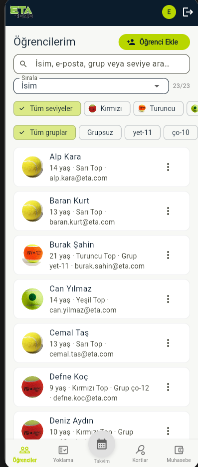
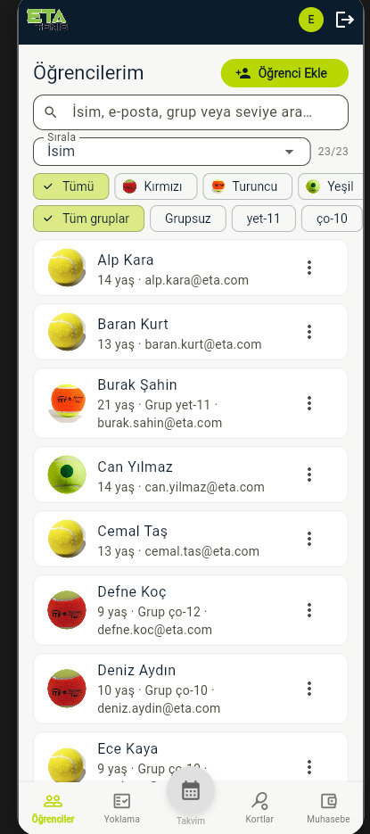
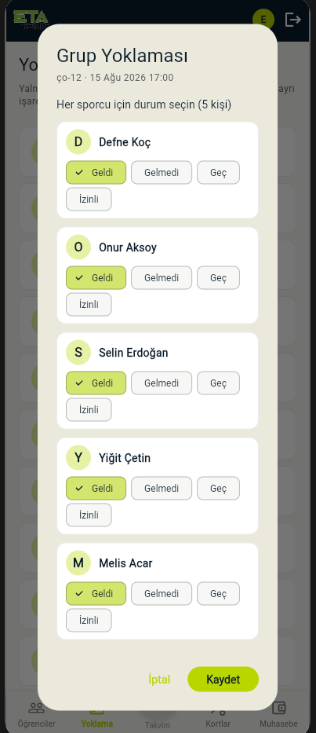
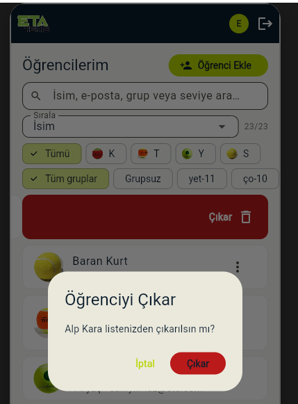

# ETA Tenis CRM — UX İyileştirmeleri

Bu sürümde antrenör panelinin günlük kullanımını hızlandırmak için **öğrenciler**, **yoklama** ve **görsel kontrast** odaklı iyileştirmeler yapıldı. Aşağıdaki görseller geliştirme sırasında yakalanan ekranlardır.

---

## 1. Öğrenciler: arama, filtre ve seviye

Öğrenci listesi artık hızlı taranabilir:

- İsim / e-posta / grup / seviye **arama**
- Top seviyesi ve grup için **yatay kaydırılabilir** filtreler
- Seviye chip’leri: yalnızca **top görselleri** (harfsiz, sabit boyutlu chip)

---

## 4. Kort kiralama: üye girişi, kredi ve güvenli rezervasyon

PFM benzeri kredi sistemi ve çift rezervasyonu önleyen atomik kiralama eklendi.

**Üye girişi**
- Login’de **Üye** aktif: `can.yilmaz@eta.com` / `sporcu123`
- Üye yalnızca kort durumunu görür ve kiralama yapar
- Antrenör akışı aynı şekilde devam eder

**Kredi sistemi**
- 1 saatlik slot = **1 kredi**
- Kiralama diyalogunda bakiye ve ücret gösterilir
- Gerçek ödeme yok; **Test Kredi** popup ile +5 / +10 / +20 / +50 yükleme
- Demo üye başlangıç bakiyesi: **20 kredi**

**Güvenilir kiralama (DB transaction)**
- Müsaitlik + ders/blok çakışması + aynı üyenin çakışan kirası + kredi düşümü tek transaction
- `CreditTransactions` defteri ile izlenebilir kayıt

**Kort grid görünümü**
- Kiralama slotlarında **kiracı adı** görünür
- Grup (sol şerit) / özel ders (antrenör rengi) / kiralama (turuncu sağ şerit) görsel ayrımı
- Web layout hataları giderildi (sıfır boyutlu slot / focus traversal)

---

## 2. Yoklama: daha az yer, daha hızlı işaretleme

Grup yoklamasında dört seçenek iki satıra yayılıyordu ve diyalog şişiyordu.

**Önce:** Geldi / Gelmedi / Geç / İzinli

**Sonra:**

- Tek satır: **Geldi · Gelmedi · Diğer**
- **Diğer** → Geç / İzinli popup
- Sekmede **Bugün** / **Tüm yoklamalar**
- Varsayılan: bugünün dersleri
- **Alındı / Alınmadı** durumu görünür
- **Alınmayanlar** filtresi + hızlı **Al** butonu

---

## 3. Kontrast ve marka okunabilirliği

Koyu app bar üzerinde logonun koyu kısmı kayboluyor, diyaloglarda **İptal** açık yeşil olduğu için zor okunuyordu.

**Düzeltmeler:**

- App bar’da logo beyaz kapsül içinde (`EtaLogo(onDark: true)`)
- Tüm `TextButton` / diyalog metinleri lacivert (okunabilir)
- Ortak tema: diyalog, menü, outlined buton kontrastı

---

## Teknik özet

| Alan | Değişiklik |
|------|------------|
| Öğrenciler | Arama, yatay filtre scroll, ITF top görselleri |
| Yoklama | Kompakt durum seçimi, Bugün/Tümü, alınmayanlar |
| Tema | Kontrast odaklı `AppTheme` + `EtaLogo` |
| Kort kiralama | Üye girişi, kredi, atomik `bookCourtRental`, kiracı adı slot |
| Veri | Şema v8: `creditBalance`, `CreditTransactions`, ball level |

---

*ETA Tenis Akademisi — antrenör CRM*
